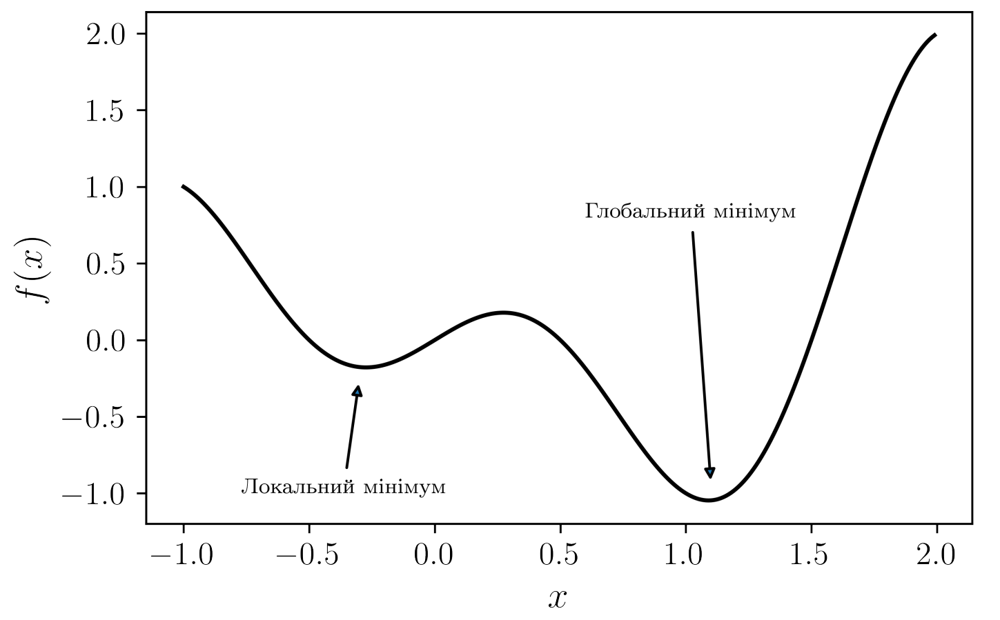

class: middle, center, title-slide

# Методи чисельної оптимізації

Лекція 1: Вступ до оптимізації

  
Кочура Юрій Петрович 
[iuriy.kochura@gmail.com](mailto:iuriy.kochura@gmail.com)  
<a href="https://t.me/y_kochura">@y_kochura</a>  

---

class:  black-slide, 
background-image: url(./figures/lec1/blog-header-cost-optimization-examples.jpg)
background-size: cover

# Сьогодні

.larger-x[ 
 

🎙️ Математична постановка задачі оптимізації  
🎙️ Неперервна та дискретна оптимізація   
🎙️ Обмежена та необмежена оптимізація   
🎙️ Глобальна та локальна оптимізація  
🎙️ Стохастична та детермінована оптимізація      
🎙️ Вимоги до оптимізаційних алгоритмів  

]

---

class: blue-slide, middle, center
count: false

.larger-xx[Математична постановка задачі оптимізації]

---

class: middle

# Де використовується?

Оптимізація присутня всюди

.smaller-xx[машинне навчання, великі дані, статистика,  фінанси, логістика, планування, теорія керування, математика, пошукові системи, симуляції та багато інших застосувань ...]

- Математичне моделювання
  - визначення та побудова моделі задачі оптимізації
- Обчислювальна оптимізація
  - запуск відповідного алгоритму оптимізації

---

class: middle

# Оптимізація

Постановка задачі оптимізації (без обмежень)
- мінімізація $f(\mathbf{x})$: 
$$\mathbf{x}^* = \arg \min\_{\mathbf{x} \in \mathbb{R}^n} f(\mathbf{x})$$

$$P: f(\mathbf{x}^*) =  \min\_{\mathbf{x} \in \mathbb{R}^n} f(\mathbf{x})$$

$\mathbf{x} = (x_1, x_2, ..., x_n)$ &mdash;  $n$-вимірний вектор (оптимізаційна змінна задачі), $f: \mathbb{R}^n \rightarrow \mathbb{R}$ &mdash; цільова функція, $\mathbf{x}^*$ &mdash; розв'язок задачі $P$.

 
- максимізація $f(\mathbf{x})$:

$$\mathbf{x}^* = \arg \max\_{\mathbf{x} \in \mathbb{R}^n} f(\mathbf{x})$$

$$P: f(\mathbf{x}^*) =  \max\_{\mathbf{x} \in \mathbb{R}^n} f(\mathbf{x})$$

???
Люди оптимізують.
Інвестори прагнуть створювати портфелі, які уникають надмірного ризику та водночас забезпечують високий рівень прибутковості. Виробники намагаються досягти максимальної ефективності для своїх виробничих процесів. Інженери підбирають параметри для оптимізації продуктивності своїх розробок.

Природа теж оптимізує.
Фізичні системи тяжіють до стану мінімальної енергії. Молекули в ізольованій хімічній системі реагують одна з одною доти, доки загальна потенційна енергія їхніх електронів не буде мінімізована. Промені світла рухаються шляхами, що мінімізують час їх проходження.

У математичному аналізі задача оптимізації використовується для визначення екстремального значення (зазвичай неперервної) функції з дійсними значеннями на заданому проміжку. Максимальне або мінімальне значення можна визначити, досліджуючи поведінку функції та (якщо вона існує) її похідну.

Оптимізація є важливим інструментом для прийняття рішень та аналізу фізичних систем. Щоб скористатися цим інструментом, спершу необхідно визначити певну мету — кількісну міру ефективності роботи досліджуваної системи. Такою метою може бути прибуток, час, енергія або будь-яка інша величина чи їхня комбінація, яку можна подати одним числом.

Цільова функція залежить від певних характеристик системи, які називають змінними або невідомими. Наше завдання полягає у знаходженні таких значень змінних, які оптимізують цільову функцію. Часто змінні підлягають певним обмеженням. Наприклад, такі величини, як густина електронів у молекулі або відсоткова ставка за кредитом, не можуть бути від’ємними.

---

class: middle

# Навіщо потрібна оптимізація?

1. Різні алгоритми можуть працювати краще або гірше для різних задач $P$ (іноді дуже суттєво).
1. Розглядаючи задачу $P$ в контексті оптимізації, можна отримати більш повне розуміння статистичного процесу.
1. Знання методів оптимізації сприяє розробці нових задач $P$, які можуть мати більшу користь.

Оптимізація швидко розвивається як наукова галузь. Проте ще залишається багато можливостей для прогресу, особливо на перетині з машинним навчанням та статистикою.

---

class: middle

# Приклади

*Оптимізація портфеля*

- .bold[змінні]: обсяги інвестицій у різні активи
- .bold[обмеження]: бюджет, максимальний/мінімальний розмір інвестиції на актив, мінімальний прибуток
- .bold[цільова функція]: загальний ризик або прибуток

*Навчання нейронних мереж*

- .bold[змінні]: параметри моделі
- .bold[обмеження]: розмір датасету, апріорна інформація
- .bold[цільова функція]: міра невідповідності або похибка прогнозу

---

class: blue-slide, middle, center
count: false

.larger-xx[Неперервна та дискретна оптимізація]

---

class: middle

Дискретна оптимізація (без обмежень)
- мінімізація $f(\mathbf{x})$: 
$$\mathbf{x}^* = \arg \min\_{\mathbf{x} \in \mathbb{Z}^n} f(\mathbf{x})$$

$$P: f(\mathbf{x}^*) =  \min\_{\mathbf{x} \in \mathbb{Z}^n} f(\mathbf{x})$$

$$f: \mathbb{Z}^n \rightarrow \mathbb{R}$$

Неперервна оптимізація (без обмежень)
- мінімізація $f(\mathbf{x})$: 
$$\mathbf{x}^* = \arg \min\_{\mathbf{x} \in \mathbb{R}^n} f(\mathbf{x})$$

$$P: f(\mathbf{x}^*) =  \min\_{\mathbf{x} \in \mathbb{R}^n} f(\mathbf{x})$$

$$f: \mathbb{R}^n \rightarrow \mathbb{R}$$

???
У деяких задачах оптимізації змінні мають сенс лише тоді, коли приймають цілі значення.

- Кількість вироблених одиниць продукції.
- Кількість побудованих електростанцій певного типу.
- Кількість працівників, яких потрібно найняти.
- Розподіл завдань між машинами або працівниками.
- Вибір місця розташування фабрики: 1 — будувати, 0 — не будувати.

Математична постановка таких задач включає цілочисельні обмеження ($\mathbf{x} \in \mathbb{Z}$) — множина цілих чисел, або бінарні обмеження. Задачі цього типу називаються задачами цілочисельного програмування. Якщо деякі змінні в задачі не обмежені бути цілими або бінарними, такі задачі іноді називають задачами змішаного цілочисельного програмування (Mixed Integer Programming, MIP).

Задачі цілочисельного програмування є різновидом дискретної оптимізації. Загалом, дискретні задачі оптимізації можуть містити не лише цілі та бінарні змінні, а й більш абстрактні об’єкти змінних, такі як перестановки впорядкованої множини.

Визначальною особливістю дискретної задачі оптимізації є те, що невідомі $x$ належать скінченній (хоча й часто дуже великій) множині.

На противагу цьому,  множина для неперервних задач оптимізації — клас задач, що розглядаються в цьому курсі — зазвичай є нескінченною, коли $x$ можуть бути дійсними числами.

---

class: blue-slide, middle, center
count: false

.larger-xx[Обмежена та необмежена оптимізація]

---

class: middle

# Оптимізація

## Обмежена

$$P: \min\_{\mathbf{x} \in \mathbb{R}^n} f(\mathbf{x}) \;\:\: \;\:\: \text{за умови} \begin{cases}
c\_i(\mathbf{x}) = 0, & i \in E, \\\\
c\_i(\mathbf{x}) \ge 0, & i \in I.
\end{cases}$$

Тут $I$ та $E$ &mdash; це множини індексів для нерівностей та рівнянь відповідно.

## Необмежена
$$E = I = \varnothing$$

Задачі оптимізації можна систематизувати за різними критеріями: за типом цільової функції та обмежень (наприклад, лінійні, нелінійні, випуклі), за числом змінних, а також за властивостями функцій (диференційовані чи недиференційовані).

???
Задачі оптимізації з обмеженнями виникають у моделях, де обмеження відіграють ключову роль, наприклад, при накладанні бюджетних обмежень у економічній задачі або обмежень форми у задачі проєктування. Ці обмеження можуть бути:
- простими межами, наприклад, 0≤x≤100
- більш загальними лінійними обмеженнями, наприклад, ∑ixi≤1
- нелінійними нерівностями, що відображають складні взаємозв’язки між змінними.

Задачі оптимізації без обмежень, для яких E=I=∅, виникають безпосередньо у багатьох практичних застосуваннях. Задачі без обмежень також виникають як переформульовані задачі оптимізації з обмеженнями, коли обмеження замінюються штрафними доданками до цільової функції, що заохочують уникати порушення обмежень.

Якщо цільова функція та всі обмеження є лінійними функціями змінної $x$, така задача називається задачею лінійного програмування. Задачі цього типу, ймовірно, є найпоширенішими серед усіх задач оптимізації, особливо в управлінні, фінансах та економіці.

Нелінійні задачі програмування, у яких принаймні деякі обмеження або цільова функція є нелінійними, зазвичай виникають у природничих науках та інженерії, а також дедалі ширше застосовуються в управлінні та економіці.

---

class: blue-slide, middle, center
count: false

.larger-xx[Глобальна та локальна оптимізація]

---

class: middle

.center.width-90[] 

???
Багато алгоритмів для нелінійних задач оптимізації шукають лише локальний розв'язок — точку, в якій цільова функція менша, ніж у всіх інших допустимих точках, розташованих поблизу. Вони не завжди знаходять глобальне рішення, тобто точку з найменшим значенням функції серед усіх допустимих точок.

Глобальні розв'язки необхідні у деяких застосуваннях, проте для багатьох задач їх важко розпізнати і ще складніше знайти. Для задач випуклого програмування, а особливо для лінійних програм, локальні розв'язки збігаються з глобальними. Загальні нелінійні задачі, як з обмеженнями, так і без них, можуть мати локальні розв'язки, які не є глобальними.

---

class: blue-slide, middle, center
count: false

.larger-xx[Стохастична та детермінована оптимізація]

---

class: middle

.alert[Процес визначення цільової функції, змінних та обмежень для заданої задачі називається .bold[моделюванням].
Побудова адекватної моделі є першим  і часто найважливішим кроком у процесі оптимізації.]

## Стохастична оптимізація

- модель містить невідомі величини (майбутні ціни, попит, ставки тощо);
- використовує сценарії з ймовірностями;
- рішення оптимізує очікувану ефективність.

Підходи до роботи з невизначеністю

- Ймовірнісні обмеження: виконання обмежень з певною ймовірністю;
- Робастна оптимізація: обмеження виконуються для всіх можливих сценаріїв.

## Детермінована оптимізація

- модель відома повністю;

---

class: blue-slide, middle, center
count: false

.larger-xx[Вимоги до оптимізаційних алгоритмів]

---

class: middle

## Оптимізаційні алгоритми

- Ітеративні: починають з початкового наближення та генерують послідовність покращень
- Використовують інформацію:
  - значення цільової функції $f(x)$
  - обмеження $c\_i(x)$
  - похідні (1-го, 2-го порядку)
- Стратегії:
  - локальні (лише поточна точка)
  - з накопиченням попередньої інформації

---

class: middle

## Вимоги до оптимізаційних алгоритмів

- .bold[Надійність] &mdash; стабільна робота на широкому класі задач та для різних стартових точок.
- .bold[Ефективність] &mdash; не потребують надмірного часу чи пам’яті.
- .bold[Точність] &mdash; знаходять розв'язок з необхідною точністю, не надто чутливі до похибок даних і обчислень.

---

class: middle, center, black-slide

<iframe width="600" height="450" src="https://www.youtube.com/embed/FhQXcvnR-0U?start=55" frameborder="0" allowfullscreen></iframe>

Оптимізація у природі

---

class: end-slide, center
count: false

.larger-xxxx[🏁]