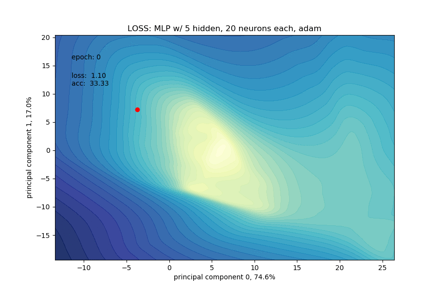
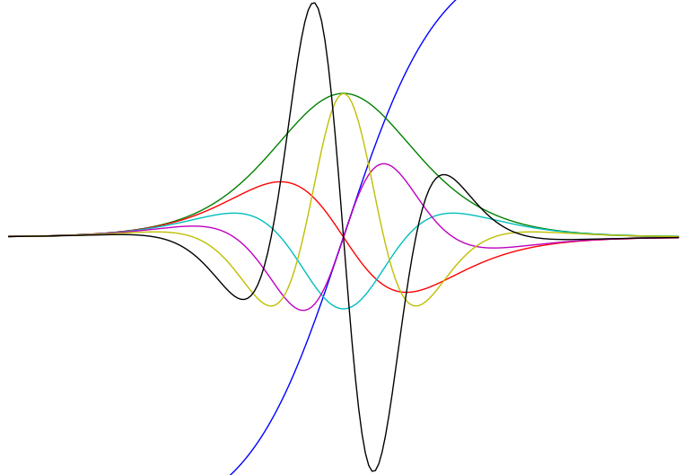
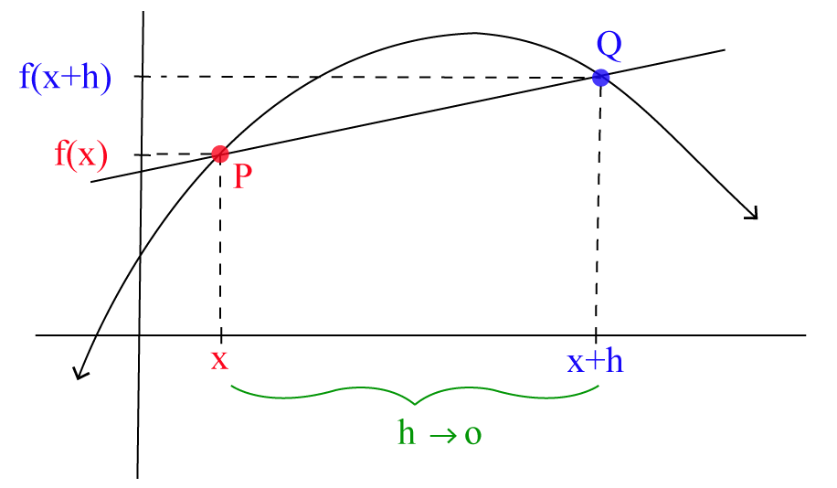
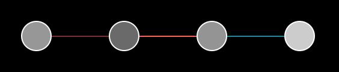
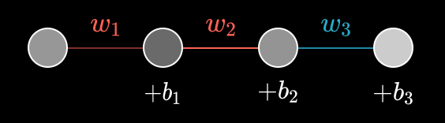
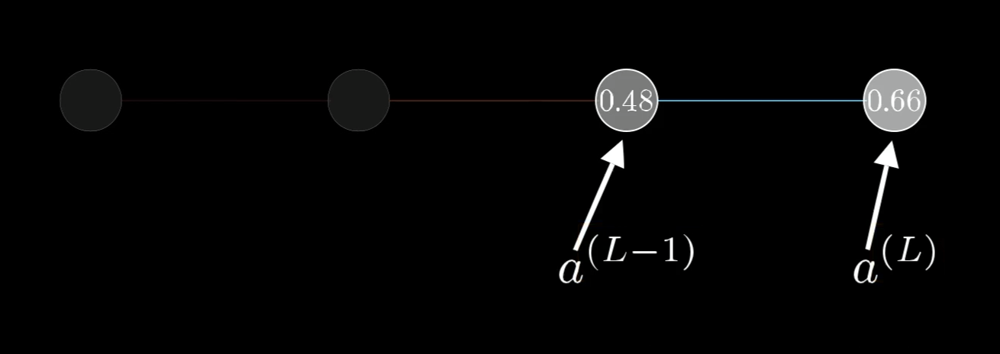
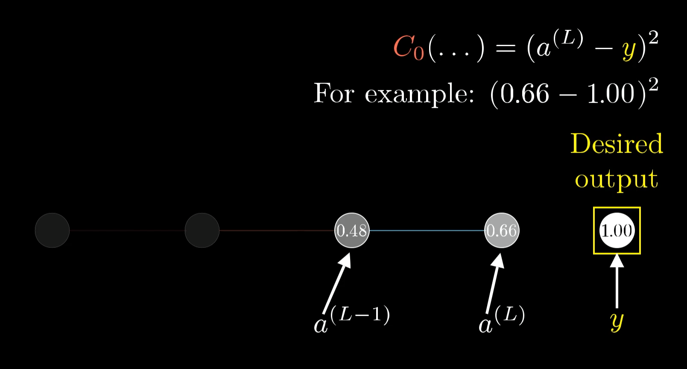
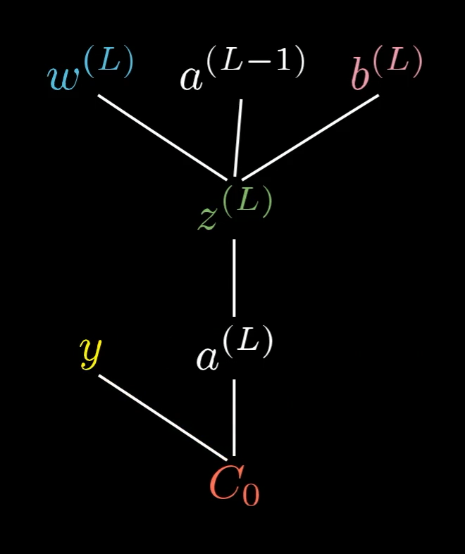
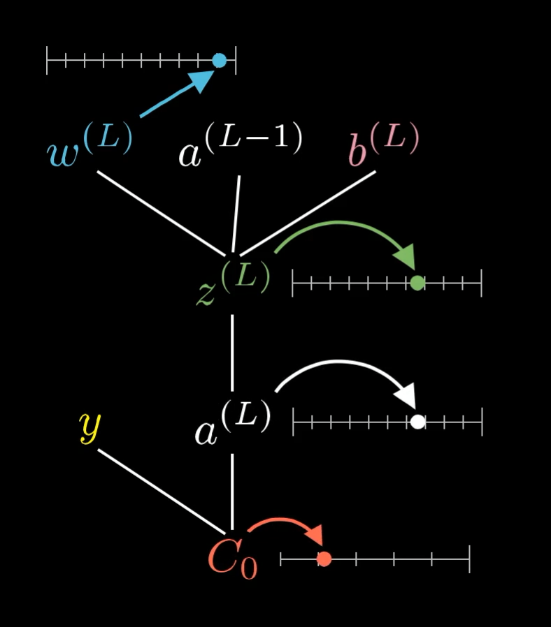
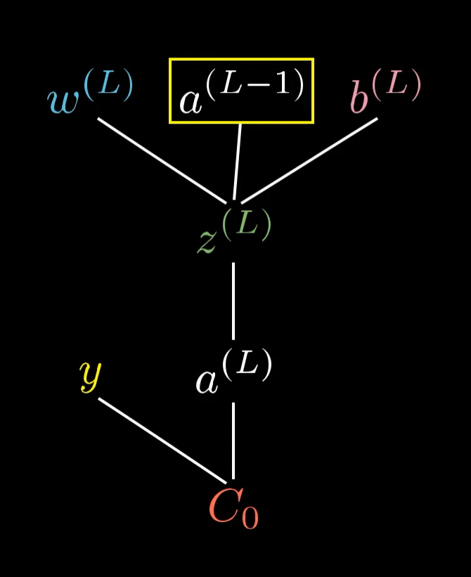

class: middle, center, title-slide

# Методи чисельної оптимізації

Лекція 2: Автоматичне диференціювання
<br><br>
Кочура Юрій Петрович<br>
[iuriy.kochura@gmail.com](mailto:iuriy.kochura@gmail.com) <br>
<a href="https://t.me/y_kochura">@y_kochura</a> <br>

---


class:  black-slide, 
background-image: url(./figures/lec1/blog-header-cost-optimization-examples.jpg)
background-size: cover

# Сьогодні

.larger-x[ <p class="shadow" style="line-height: 200%;"> 

🎙️ Мотивація <br>
🎙️ Огляд: похідна, градієнт, якобіан <br>
🎙️ Обчислення градієнтів у зворотному поширенні <br>
🎙️ Імплементація у фреймворках <br>  
</p>]

---

class: blue-slide, middle, center
count: false

.larger-xx[Мотивація]

---

class: middle

.center.width-75[]

## Мотивація

- Алгоритми навчання на основі градієнтів є рушієм глибокого навчання.
- Обчислювати градієнти вручну &mdash; справа стомлююча та схильна до помилок. Це швидко стає непрактичним для складних моделей.
- Зміни в моделі вимагають повторного обчислення градієнтів.
  
<br>

.footnote[Джерело зображення: [Visualizing optimization trajectory of neural nets](https://towardsdatascience.com/from-animation-to-intuition-visualizing-optimization-trajectory-in-neural-nets-726e43a08d85), Logan Yang, 2020.]

---

class: middle

## Програми як диференційовані функції

Програма визначається як композиція простих функцій, які ми знаємо, як диференціювати окремо.

```python
import jax.numpy as jnp
from jax import grad

def predict(params, inputs):
    for W, b in params:
        outputs = jnp.dot(inputs, W) + b
        inputs = jnp.tanh(outputs)
    return outputs

def loss_fun(params, inputs, targets):
    preds = predict(params, inputs)
    return jnp.mean((preds - targets)**2)

grad_fun = grad(loss_fun)
```

---

class: middle

.center.width-60[]

Сучасні фреймворки підтримують похідні вищого порядку.
```python
def tanh(x):
    y = jnp.exp(-2.0 * x)
    return (1.0 - y) / (1.0 + y)

fp = grad(tanh)
fpp = grad(grad(tanh))  # друга похідна
...
```

---

class: middle

# Автоматичне диференціювання

Автоматичне диференціювання надає набір методів для оцінки **похідних** функції, заданої *комп’ютерною програмою*.

- $\neq$ символьне диференціювання, яке спрямоване на знаходження деякого зрозумілого людині виразу похідної.
- $\neq$ чисельне диференціювання (наприклад, методом кінцевих різниць) може призвести до помилок округлення.

---

class: blue-slide, middle, center
count: false

.larger-xx[Огляд]

Похідна, градієнт, якобіан

---

class: middle

# Похідна

Нехай $f: \mathbb{R} \to \mathbb{R}$ 

Похідна неперервної функції $f$ визначається як:
$$f'(x) = \frac{\partial f(x)}{\partial x} \triangleq \lim\_{h \to 0} \frac{f(x + h) - f(x)}{h},$$
де
- $f'(x)$ &mdash; це позначення похідної за Лагранжом,
- $\frac{\partial f(x)}{\partial x}$ &mdash; це позначення похідної за Лейбніцем.

---

class: middle, 

.width-80[]

Похідна $\frac{\partial f(x)}{\partial x}$ показує миттєву швидкість зміни $f$ у точці $x$.


.footnote[Джерело: [Definition Of Derivative](https://calcworkshop.com/derivatives/definition-of-derivative/)]

---

class: black-slide,

# Градієнт

Градієнт неперервної функції $f : \mathbb{R}^n \to \mathbb{R}$ 
$$\nabla f(\mathbf{x}) \triangleq 
\begin{bmatrix}
\frac{\partial f(\mathbf{x})}{\partial x\_1} \\\\[8pt]
\frac{\partial f(\mathbf{x})}{\partial x\_2} \\\\
\\\\
\vdots \\\\
\\\\
\frac{\partial f(\mathbf{x})}{\partial x\_n}
\end{bmatrix} \in \mathbb{R}^n,$$
тобто вектор, який акумулює часткові похідні від $f$.

Застосовуючи визначення похідної за координатами, маємо
$$\left[ \nabla f(\mathbf{x}) \right]\_j = \frac{\partial f}{\partial x\_j}(\mathbf{x}) = \lim\_{h\to 0} \frac{f(\mathbf{x} + h\mathbf{e}\_j) - f(\mathbf{x})}{h},$$
де $\mathbf{e}\_j$ &mdash; $j$-й базисний вектор.

---

class: black-slide,

# Якобіан

Якобіан $\mathbf{f} : \mathbb{R}^n \to \mathbb{R}^m$ 
$$\begin{aligned}
J\_\mathbf{f}(\mathbf{x}) = \frac{\partial \mathbf{f}(\mathbf{x})}{\partial \mathbf{x}} &\triangleq
\begin{bmatrix}
\frac{\partial f\_1}{\partial x\_1}(\mathbf{x}) & \ldots & \frac{\partial f\_1}{\partial x\_n}(\mathbf{x})\\\\
\\\\
\vdots & & \vdots\\\\
\\\\
\frac{\partial f\_m}{\partial x\_1}(\mathbf{x}) & \ldots & \frac{\partial f\_m}{\partial x\_n}(\mathbf{x})
\end{bmatrix} \in \mathbb{R}^{m \times n} \\\\
&= \begin{bmatrix}
\frac{\partial \mathbf{f}}{\partial x\_1}(\mathbf{x}) & \ldots & \frac{\partial \mathbf{f}}{\partial x\_n}(\mathbf{x})
\end{bmatrix} \\\\
&= \begin{bmatrix}
\nabla f\_1(\mathbf{x})^T \\\\
\\\\
\vdots \\\\
\\\\
\nabla f\_m(\mathbf{x})^T 
\end{bmatrix} \\\\
\end{aligned}$$

Для ($m=1$) якобіан $=$ градієнт.

---

class: blue-slide, middle, center
count: false

.larger-xx[Обчислення градієнтів у зворотному поширенні]

---

class: black-slide, middle

.center.width-100[]


Почнемо з досить простої мережі, де кожен шар має лише один нейрон.

.footnote[Джерело: [Grant Sanderson](https://www.3blue1brown.com/lessons/backpropagation-calculus)]

---

class: black-slide, middle

.center.width-100[]


.footnote[Джерело: [Grant Sanderson](https://www.3blue1brown.com/lessons/backpropagation-calculus)]

???
Ця мережа визначається 3 вагами (по одному для кожного з’єднання) і 3 зміщеннями (по одному для кожного нейрона). Наша мета — зрозуміти, як зміна кожного з них вплине на функцію втрат. Таким чином ми будемо знати, які коригування спричинять найбільш ефективне зменшення функції втрат.

---

class: black-slide, middle

.center.width-100[]


.footnote[Джерело: [Grant Sanderson](https://www.3blue1brown.com/lessons/backpropagation-calculus)]

???
Давайте зосередимося на зв’язку між двома останніми нейронами.  Тут активацію останнього нейрона позначено верхнім індексом $L$  -- це вказує, на якому шарі знаходиться даний нейрон, тому активація попереднього нейрона є $a^{(L-1)}$. Це лише спосіб вказання індексу того шару, про який ми говоримо.

---

class: black-slide, middle

.center.width-100[]


.footnote[Джерело: [Grant Sanderson](https://www.3blue1brown.com/lessons/backpropagation-calculus)]

???
Скажімо, для деякого навчального прикладу очікуваний результат є $y$. Це означає, що втрата мережі для одного навчального прикладу становить: $C\_0=(a^{(L)} - y)^2$. Тобто, втрати мережі для цього прикладу навчання є просто різницею між фактичним виходом та реальним (очікуваним) виходом взятим у квадраті.

---

class: black-slide, middle

.larger-x[

$$a^{(L)} = \sigma \bigl( w^{(L)}a^{(L-1)} + b^{(L)}\bigr)$$

<br><br>

$$\color{gray} z^{(L)} =  w^{(L)}a^{(L-1)} + b^{(L)}$$

$$\color{gray} a^{(L)} = \sigma \bigl(z^{(L)}\bigr)$$
]

.footnote[Джерело: [Grant Sanderson](https://www.3blue1brown.com/lessons/backpropagation-calculus)]

???
Нагадую, що активація на заданому нейроні визначається вагою, зсувом та активацією попереднього нейрона, до лінійної комбінації вагових коефіціїєнтів з активаціює попереднього шару + зсув, застосовується спеціальна нелінійна функція: сигмоід,  ReLU тощо.

---

class: black-slide, middle
count: false

.larger-x[

$$\color{gray} a^{(L)} = \sigma \bigl( w^{(L)}a^{(L-1)} + b^{(L)}\bigr)$$

<br><br>

$$z^{(L)} =  w^{(L)}a^{(L-1)} + b^{(L)}$$

$$a^{(L)} = \sigma \bigl(z^{(L)}\bigr)$$
]

.footnote[Джерело: [Grant Sanderson](https://www.3blue1brown.com/lessons/backpropagation-calculus)]

---


class: black-slide, middle


# Обчислювальний граф

.center.width-55[]

.footnote[Джерело: [Grant Sanderson](https://www.3blue1brown.com/lessons/backpropagation-calculus)]

???
Це можна концептуалізувати так, що ваги, активація з попереднього шару та зсув разом дозволяють нам обчислити $z^{(L)}$, що, у свою чергу, дозволяє обчислити $a^{(L)}$, що, у свою чергу, разом із константою $y$ дозволяє нам обчислити втрати.

---


class: black-slide, middle

# Обчислювальний граф

.center.width-45[]

.footnote[Джерело: [Grant Sanderson](https://www.3blue1brown.com/lessons/backpropagation-calculus)]

---


class: black-slide, middle

.center.width-60[]

Усі ці змінні просто числа, тому було б добре уявити, що кожна змінна має власну числову шкалу.

.footnote[Джерело: [Grant Sanderson](https://www.3blue1brown.com/lessons/backpropagation-calculus)]


---


class: black-slide, middle

Наша перша мета &mdash; зрозуміти, наскільки втрата $\color{red}C\_0$ чутлива до невеликих змін вагових коефіцієнтів  $\color{lightblue}w^{(L)}$.  Тобто ми хочемо знати похідну $\frac{\color{red} \partial C\_0}{\color{lightblue} \partial w^{(L)}}$. Невелике збурення $\color{lightblue}w^{(L)}$ має ланцюжок ефектів, які зрештою спричиняють збурення  $\color{red}C\_0$.


.center[
<video loop controls preload="auto" height="500" width="700">
  <source src="./figures/lec2/derivative-wiggle.mp4" type="video/mp4">
</video>

]

.footnote[Джерело: [Grant Sanderson](https://www.3blue1brown.com/lessons/backpropagation-calculus)]

---


class: black-slide, middle

.center.width-40[]

.larger-x[

$$\color{white}\boxed{ \frac{\color{red} \partial C\_0}{\color{lightblue} \partial w^{(L)}} = \frac{\color{red} \partial C\_0}{\partial a^{(L)}} \frac{ \partial a^{(L)}}{\color{lightgreen} \partial z^{(L)}} \frac{\color{lightgreen} \partial z^{(L)}}{\color{lightblue} \partial w^{(L)}}}$$

]

Це правило ланцюжка, де множення цих трьох співвідношень дає нам чутливість $\color{red}C\_0$ до невеликих змін $\color{lightblue}w^{(L)}$.

.footnote[Джерело: [Grant Sanderson](https://www.3blue1brown.com/lessons/backpropagation-calculus)]

---


class: black-slide, middle

# Похідні


$$\boxed{\begin{aligned}
{\color{lightgreen}z^{(L)}} &=  {\color{lightblue}w^{(L)}}a^{(L-1)} + b^{(L)} \: &   \longrightarrow \:   \frac{\color{lightgreen} \partial z^{(L)}}{\color{lightblue} \partial w^{(L)}} &= a^{(L-1)} \\\\[1.5em]
a^{(L)} &= \sigma \bigl({\color{lightgreen}z^{(L)}}\bigr) \: & \longrightarrow \:   \frac{ \partial a^{(L)}}{\color{lightgreen} \partial z^{(L)}} &= \sigma^\prime \bigl({\color{lightgreen}z^{(L)}}\bigr) \\\\[1.5em]
{\color{red} C\_0} &= (a^{(L)} - y)^2 \: & \longrightarrow \:  \frac{\color{red} \partial C\_0}{\partial a^{(L)}} &= 2(a^{(L)} - y)
\end{aligned}}$$


.larger-x[

$$\color{white}\boxed{ \frac{\color{red} \partial C\_0}{\color{lightblue} \partial w^{(L)}} = \frac{\color{red} \partial C\_0}{\partial a^{(L)}} \frac{ \partial a^{(L)}}{\color{lightgreen} \partial z^{(L)}} \frac{\color{lightgreen} \partial z^{(L)}}{\color{lightblue} \partial w^{(L)}}}$$

]


Як бачите, кожна похідна досить проста, якщо знати для якого рівняння шукати похідну.

.footnote[Джерело: [Grant Sanderson](https://www.3blue1brown.com/lessons/backpropagation-calculus)]

---

class: black-slide, middle


$$\boxed{\begin{aligned}
{\color{lightgreen}z^{(L)}} &=  {\color{lightblue}w^{(L)}}a^{(L-1)} + b^{(L)} \: &   \longrightarrow \:   \frac{\color{lightgreen} \partial z^{(L)}}{\color{lightblue} \partial w^{(L)}} &= a^{(L-1)} \\\\[1.5em]
a^{(L)} &= \sigma \bigl({\color{lightgreen}z^{(L)}}\bigr) \: & \longrightarrow \:   \frac{ \partial a^{(L)}}{\color{lightgreen} \partial z^{(L)}} &= \sigma^\prime \bigl({\color{lightgreen}z^{(L)}}\bigr) \\\\[1.5em]
{\color{red} C\_0} &= (a^{(L)} - y)^2 \: & \longrightarrow \:  \frac{\color{red} \partial C\_0}{\partial a^{(L)}} &= 2(a^{(L)} - y)
\end{aligned}}$$


.larger-x[

$$\color{white}\boxed{ \frac{\color{red} \partial C\_0}{\color{lightblue} \partial w^{(L)}} = \frac{\color{red} \partial C\_0}{\partial a^{(L)}} \frac{ \partial a^{(L)}}{\color{lightgreen} \partial z^{(L)}} \frac{\color{lightgreen} \partial z^{(L)}}{\color{lightblue} \partial w^{(L)}}}$$

]


.larger-x[

$$\color{white}\boxed{ \frac{\color{red} \partial C\_0}{\color{lightblue} \partial w^{(L)}} = 2(a^{(L)} - y) \sigma^\prime \bigl({\color{lightgreen}z^{(L)}}\bigr) a^{(L-1)}}$$

]

.footnote[Джерело: [Grant Sanderson](https://www.3blue1brown.com/lessons/backpropagation-calculus)]

---


class: black-slide, middle


.larger-x[

$$\color{white}\boxed{ \frac{\color{red} \partial C\_0}{\color{lightblue} \partial w^{(L)}} = 2(a^{(L)} - y) \sigma^\prime \bigl({\color{lightgreen}z^{(L)}}\bigr) a^{(L-1)}}$$

]

Ця формула показує як вплине значення вагового коефіцієнта $\color{lightblue} w^{(L)}$  на втрати мережі. Це лише один дуже конкретний шматок інформації, нам потрібно обчислити ще багато подібних похідних, щоб отримати весь вектор градієнта.

.footnote[Джерело: [Grant Sanderson](https://www.3blue1brown.com/lessons/backpropagation-calculus)]


???
Але хороша новина полягає в тому, що ми вже заклали основу для решти роботи, яку потрібно виконати. Тепер це лише процес узагальнення наших результатів, поки ми не зрозуміємо (у формі вектора градієнта) того, як усі ваги та зсуви мережі впливають на загальну втрату.

---


class: black-slide, middle

# Цільова функція втрат

${\color{red} C\_0}$ &mdash; втрати для одного навчального прикладу.

Цільова функція втрат мережі (усереднені втрати для всього набору даних): $$ {\color{red} C} = \frac{1}{n} \sum\_{k=0}^{n-1} {\color{red} C\_k}$$


Отже, якщо ми хочемо отримати похідну від ${\color{red} C}$ відносно ваг, нам потрібно взяти середнє значення всіх окремих похідних:

$$ \frac{\color{red} \partial C}{\color{lightblue} \partial w^{(L)}} = \frac{1}{n} \sum\_{k=0}^{n-1} \frac{\color{red} \partial C\_k}{\color{lightblue} \partial w^{(L)}} $$

Цей вираз визначає, як зміниться цільова втрата мережі, коли ми змінемо ваги останього шару, тобто $\color{lightblue} w^{(L)}$.

.footnote[Джерело: [Grant Sanderson](https://www.3blue1brown.com/lessons/backpropagation-calculus)]

???
Варто зазначити, що записи вектора градієнта включає похідні функції цінності відносно кожного вагового коефіцієнта та зсуву мережі. Отже, ця похідна, $\frac{\color{red} \partial C}{\color{lightblue} \partial w^{(L)}}$, є одним елементів градієнта!

---


class: black-slide, middle

# Обчислення повного градієнта

.larger-xl[

$$\nabla {\color{red} C} \triangleq 
\begin{bmatrix}
\frac{\color{red} \partial  C}{\color{lightblue} \partial w^{(1)}} \\\\[8pt]
\frac{\color{red} \partial  C}{ \partial b^{(1)}} \\\\
\\\\
\vdots \\\\
\\\\
\frac{\color{red} \partial  C}{\color{lightblue} \partial w^{(L)}} \\\\[8pt]
\frac{\color{red} \partial  C}{ \partial b^{(L)}} 
\end{bmatrix}$$]

???
Варто зазначити, що записи вектора градієнта включає похідні функції цінності відносно кожного вагового коефіцієнта та зсуву мережі. Отже, ця похідна, $\frac{\color{red} \partial C}{\color{lightblue} \partial w^{(L)}}$, є одним елементів градієнта!

---


class: black-slide, middle

Хороша новина полягає в тому, що чутливість функції витрат до зміни зсуву майже ідентична рівнянню для зміни ваг:

.larger-x[

$$\color{white}\boxed{ \frac{\color{red} \partial C\_0}{\color{lightblue} \partial w^{(L)}} = \frac{\color{red} \partial C\_0}{\partial a^{(L)}} \frac{ \partial a^{(L)}}{\color{lightgreen} \partial z^{(L)}} \frac{\color{lightgreen} \partial z^{(L)}}{\color{lightblue} \partial w^{(L)}}}$$

]


.larger-x[

$$\color{white}\boxed{ \frac{\color{red} \partial C\_0}{\partial b^{(L)}} = \frac{\color{red} \partial C\_0}{\partial a^{(L)}} \frac{ \partial a^{(L)}}{\color{lightgreen} \partial z^{(L)}} \frac{\color{lightgreen} \partial z^{(L)}}{\color{lightblue} \partial b^{(L)}}}$$

]


$$\boxed{\begin{aligned}
{\color{lightgreen}z^{(L)}} &=  {\color{lightblue}w^{(L)}}a^{(L-1)} + b^{(L)} \: &   \longrightarrow \:   \frac{\color{lightgreen} \partial z^{(L)}}{\color{lightblue} \partial b^{(L)}} &= 1
\end{aligned}}$$


.footnote[Джерело: [Grant Sanderson](https://www.3blue1brown.com/lessons/backpropagation-calculus)]

---


class: black-slide,

## Вплив вагів та зсуву попередніх шарів


.grid[
.kol-1-2.center.width-100[]
.kol-1-2.middle[<br><br><br><br><br><br><br><br><br><br><br>
$$ \frac{\color{red} \partial C\_0}{\partial a^{(L-1)}} = \frac{\color{red} \partial C\_0}{\partial a^{(L)}} \frac{ \partial a^{(L)}}{\color{lightgreen} \partial z^{(L)}} \frac{\color{lightgreen} \partial z^{(L)}}{\partial a^{(L-1)}}$$
]
]


Усі інші ваги та зсуви з попередніх шарів мережі мають менш прямий вплив на цільові втрати.

.footnote[Джерело: [Grant Sanderson](https://www.3blue1brown.com/lessons/backpropagation-calculus)]


???
Щойно ми визначили, як зміни ваг та  зсуву останнього шару нашої досить простої нейронній мережі вплинуть на загальні втрати. Фактично ми вже обчислили два елементи нашого вектора градієнта.

Усі інші ваги та зсуви з попередніх шарів мережі мають менш прямий вплив на цільові втрати.

Спосіб, яким ми обчислюємо цей вплив, полягає в тому, щоб спочатку побачити, наскільки чутливі втрати до активаційного значення нейрона на передостанньому шарі, $a^{(L-1)}$, а потім побачити, наскільки чутливе це значення до всіх попередніх ваг та зсувів. На щастя, похідна втарт щодо цієї активації виглядає дуже схожою на те, що ми вже бачили.

---


class: black-slide, middle

.larger-x[

$$ \frac{\color{red} \partial C\_0}{\partial a^{(L-1)}} = \frac{\color{red} \partial C\_0}{\partial a^{(L)}} \frac{ \partial a^{(L)}}{\color{lightgreen} \partial z^{(L)}} \frac{\color{lightgreen} \partial z^{(L)}}{\partial a^{(L-1)}}$$

]

<br><br><br>

$$\boxed{\begin{aligned}
{\color{lightgreen}z^{(L)}} &=  {\color{lightblue}w^{(L)}}a^{(L-1)} + b^{(L)} \: &   \longrightarrow \:   \frac{\color{lightgreen} \partial z^{(L)}}{a^{(L-1)}} &= \color{lightblue}w^{(L)}
\end{aligned}}$$


.footnote[Джерело: [Grant Sanderson](https://www.3blue1brown.com/lessons/backpropagation-calculus)]

???
Отже, зміна значення активації передостаннього шару буде впливати на $z^{(L)}$ прямо пропорційно вазі.

Але нас не хвилює, що станеться, коли ми безпосередньо змінимо активацію, тому що ми не маємо контролю над цим. Усе, що ми можемо змінити, намагаючись покращити мережу за допомогою градієнтного спуску, це значення ваг та зсуву.

---


class: black-slide, middle

Активація у передостанньому шарі визначається його власними вагами та зсувом.

.center.width-45[]


.footnote[Джерело: [Grant Sanderson](https://www.3blue1brown.com/lessons/backpropagation-calculus)]

???
Ось тут і з’являється зворотне поширення. Незважаючи на те, що ми не зможемо напряму змінити цю активацію, проте корисно відстежувати це значення, оскільки ми можемо просто повторювати це правило ланцюжка у зворотному порядку, щоб побачити, наскільки чутлива функція втрат до попередніх ваги та зсувів.

---


class: black-slide, middle

.larger-x[

$$ \frac{\color{red} \partial C\_0}{\color{lightblue} \partial w^{(L-1)}} = \frac{\color{red} \partial C\_0}{\partial a^{(L)}} \frac{ \partial a^{(L)}}{\color{lightgreen} \partial z^{(L)}} \frac{\color{lightgreen} \partial z^{(L)}}{\partial a^{(L-1)}} \frac{\partial a^{(L-1)}}{\color{lightgreen} \partial z^{(L-1)}} \frac{\color{lightgreen} \partial z^{(L-1)}}{\color{lightblue} \partial w^{(L-1)}} $$

]


<br>

$$\boxed{\begin{aligned}
{\color{lightgreen}z^{(L-1)}} &=  {\color{lightblue}w^{(L-1)}}a^{(L-2)} + b^{(L-1)} \: &   \longrightarrow \:   \frac{\color{lightgreen} \partial z^{(L-1)}}{\color{lightblue} \partial w^{(L-1)}} &= a^{(L-2)} \\\\[1.5em]
a^{(L-1)} &= \sigma \bigl({\color{lightgreen}z^{(L-1)}}\bigr) \: & \longrightarrow \:   \frac{ \partial a^{(L-1)}}{\color{lightgreen} \partial z^{(L-1)}} &= \sigma^\prime \bigl({\color{lightgreen}z^{(L-1)}}\bigr) \\\\[1.5em]
{\color{lightgreen}z^{(L)}} &=  {\color{lightblue}w^{(L)}}a^{(L-1)} + b^{(L)} \: &   \longrightarrow \:   \frac{\color{lightgreen} \partial z^{(L)}}{\color{lightblue} \partial w^{(L)}} &= a^{(L-1)}, \:   \frac{\color{lightgreen} \partial z^{(L)}}{a^{(L-1)}} = \color{lightblue}w^{(L)} \\\\[1.5em]
a^{(L)} &= \sigma \bigl({\color{lightgreen}z^{(L)}}\bigr) \: & \longrightarrow \:   \frac{ \partial a^{(L)}}{\color{lightgreen} \partial z^{(L)}} &= \sigma^\prime \bigl({\color{lightgreen}z^{(L)}}\bigr) \\\\[1.5em]
{\color{red} C\_0} &= (a^{(L)} - y)^2 \: & \longrightarrow \:  \frac{\color{red} \partial C\_0}{\partial a^{(L)}} &= 2(a^{(L)} - y)
\end{aligned}}$$


---


class: black-slide, middle

Відстежуючи залежності через наш обчислювальний граф та перемножуючи довгий ряд часткових похідних, тепер ми можемо обчислити похідну функції втрат відносно ваг чи зсуву у будь-якому шарі всієї мережі. Ми просто застосовуємо ту саму ідею правила ланцюжка, якою користувалися раніше!

.inactive-b[Оскільки ми можемо отримати будь-яку похідну, ми можемо обчислити весь вектор градієнта. Робота зроблена! Принаймні для цієї мережі.]

---

class: black-slide, middle
count: false

.inactive-b[Відстежуючи залежності через наш обчислювальний граф та перемножуючи довгий ряд часткових похідних, тепер ми можемо обчислити похідну функції втрат відносно ваг чи зсуву у будь-якому шарі всієї мережі. Ми просто застосовуємо ту саму ідею правила ланцюжка, якою користувалися раніше!]

Оскільки ми можемо отримати будь-яку похідну, ми можемо обчислити увесь вектор градієнта. Робота зроблена! Принаймні для цієї мережі.

---


class: blue-slide, middle, center
count: false

.larger-xx[Імплементація]

---


class: black-slide, middle


.center[
.width-50[]

.width-50[]

.width-30[]
]

---

class: black-slide, middle

## Примітиви

Більшість фреймворків, в яких реалізовано автоматичне диференціювання, визначаються набором комбінованих *примітивних* операцій.

.center.width-80[]

---

class: black-slide, middle

## Складання примітивів

Примітивні функції складаються разом у граф, який описує обчислення.

Обчислювальний граф будується:
- *наперед*, з абстрактного синтаксичного дерева програми або за допомогою спеціального API (наприклад, Tensorflow 1), або
- **just in time**,  відстежуючи виконання програми (наприклад, Tensorflow Eager, JAX, PyTorch).

---


class: black-slide, middle

# Підсумок

- Автоматичне диференціювання надає набір методів для оцінки **похідних** функції, заданої *комп’ютерною програмою*. Це є одним з ключових факторів, що зіграло важливу роль в революції глибокого навчання.
- .inactive-b[Автоматичне диференціювання у зворотному режимі ефективніше, коли функція має більше входів, ніж виходів.]

---

class: black-slide, middle

# Підсумок

- .inactive-b[Автоматичне диференціювання надає набір методів для оцінки **похідних** функції, заданої *комп’ютерною програмою*. Це є одним з ключових факторів, що зіграло важливу роль в революції глибокого навчання.]
- Автоматичне диференціювання у зворотному режимі ефективніше, коли функція має більше входів, ніж виходів.

---


class: end-slide, center
count: false

.larger-xxxx[🏁]

---

count: false

# Література

- Mathieu Blondel, [Automatic differentiation](https://mblondel.org/teaching/autodiff-2020.pdf), 2020.
- Gabriel Peyré, [Course notes on Optimization for Machine Learning](https://mathematical-tours.github.io/book-sources/optim-ml/OptimML.pdf), 2020.