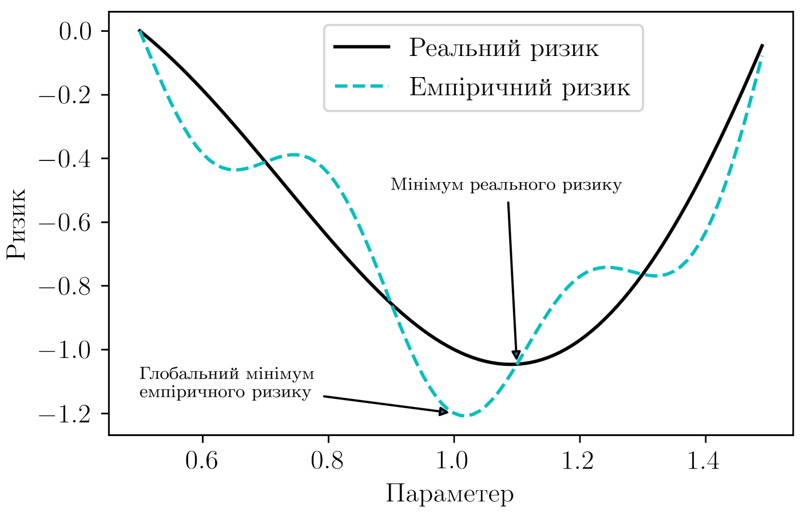
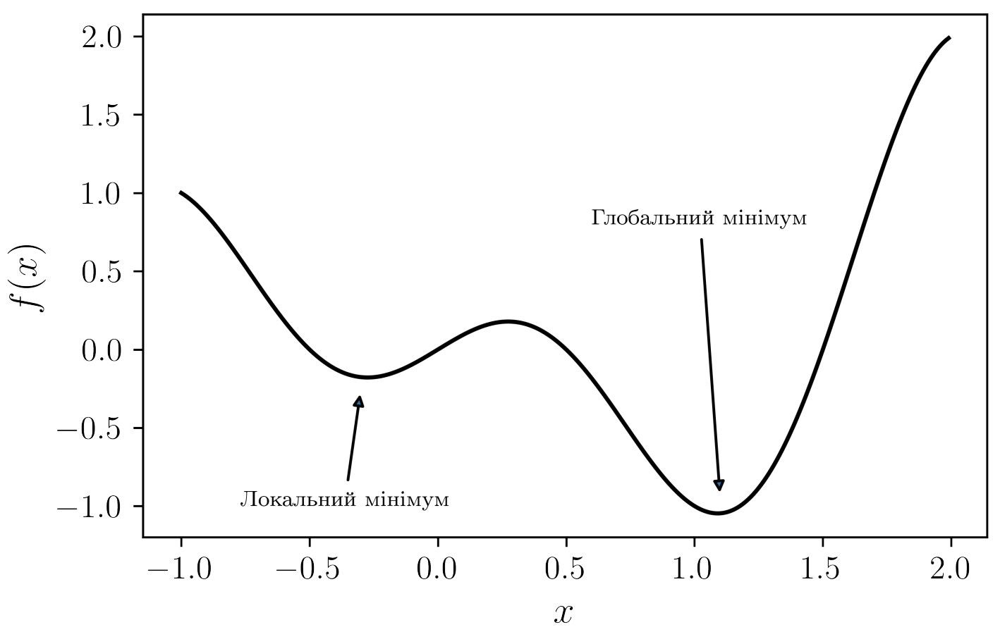
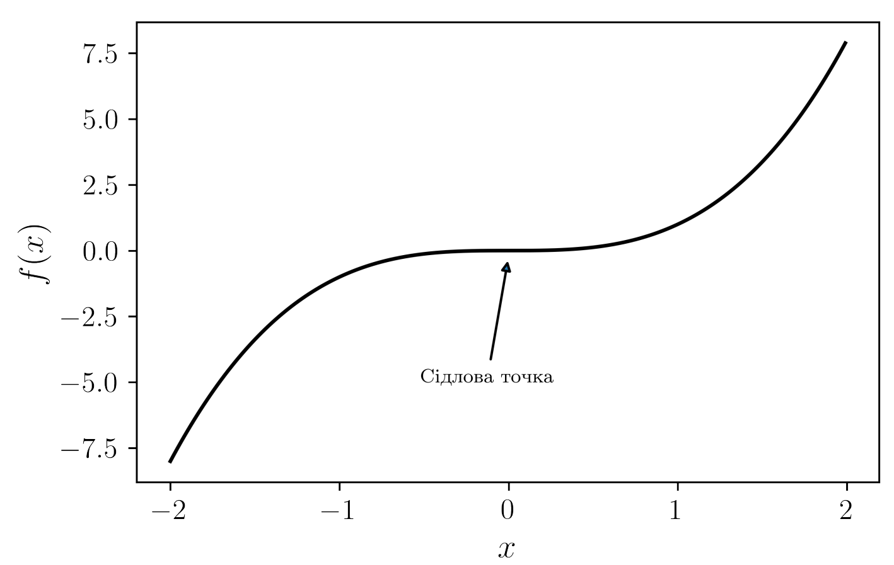
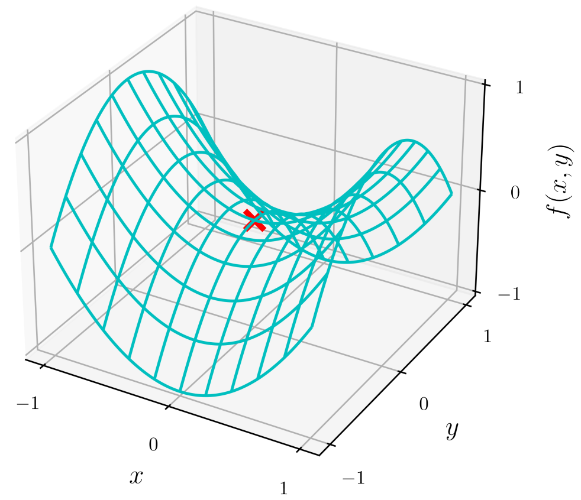
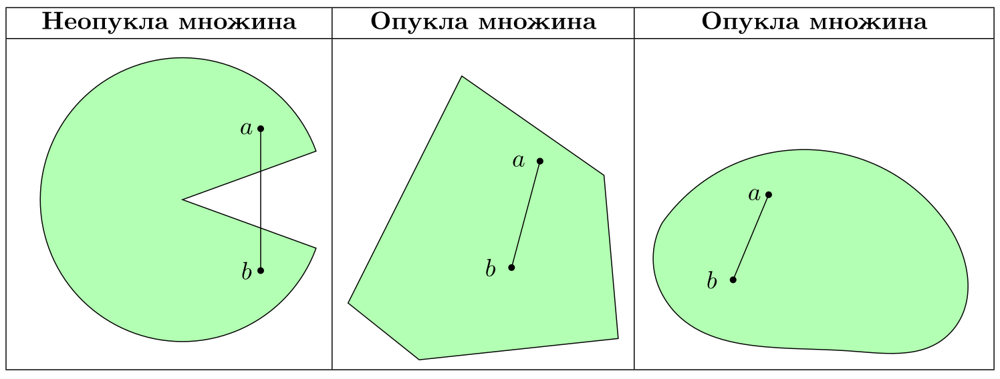
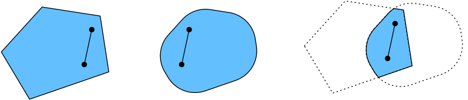
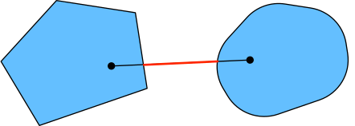
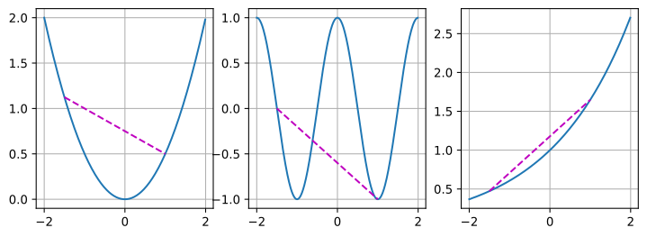

class: middle, center, title-slide

# Методи чисельної оптимізації

Лекція 3: Теоретичні основи оптимізації у глибокому навчанні
  
Кочура Юрій Петрович 
[iuriy.kochura@gmail.com](mailto:iuriy.kochura@gmail.com)  
<a href="https://t.me/y_kochura">@y_kochura</a>  

---

class:  black-slide, 
background-image: url(./figures/lec1/blog-header-cost-optimization-examples.jpg)
background-size: cover

# Сьогодні

.larger-x[ 
 

🎙️ Мета оптимізації  
🎙️ Проблеми оптимізації у глибокому навчанні  
🎙️ Опуклість множини та цільової функції  
🎙️ Нерівність Єнсена  
🎙️ Властивості опуклих функцій      

]

---

class: blue-slide, middle, center
count: false

.larger-xx[Мета оптимізації]

---

class: middle

## Оптимізація vs Глибоке навчання

| **Оптимізація**                     | **Глибоке навчання**                           |
|------------------------------------|-----------------------------------------------|
| Мінімізація цільової функції        | Побудова адекватної моделі                     |
| Орієнтація на зменшення **помилки на навчальних даних**    | Орієнтація на зменшення **помилки узагальнення** (на нових даних)        |
| Використовує втрату на навчальних даних | Працює з обмеженими даними та прагне до узагальнення |
| Фокус: алгоритм                     | Фокус: модель + здатність узагальнювати       |
| Ризик: локальні мінімуми            | Ризик: **перенавчання**                        |
  

.footnote[Джерело: [Dive into Deep Learning](https://d2l.ai/index.html).]

---

class: middle, 

.width-90[]

Мінімум емпіричного ризику на навчальному наборі даних .bold[може відрізнятися] від мінімуму реального ризику (помилки узагальнення). Це ілюструє розбіжність між оптимізацією на навчальних даних та здатністю моделі узагальнювати на нових даних.

.footnote[Джерело: [Dive into Deep Learning](https://d2l.ai/index.html).]

---

class: blue-slide, middle, center
count: false

.larger-xx[Проблеми оптимізації у глибокому навчанні]

---

class: middle,

- У глибокому навчанні більшість цільових функцій складні і .bold[не мають аналітичного розв’язку], тому використовуються .bold[чисельні алгоритми оптимізації].

.footnote[Джерело: [Dive into Deep Learning](https://d2l.ai/index.html).]

---

class: middle,
count: false

- .inactive[У глибокому навчанні більшість цільових функцій складні і .bold[не мають аналітичного розв’язку], тому використовуються .bold[чисельні алгоритми оптимізації]].

- Основні виклики: .bold[локальні мінімуми, сідлові точки та зникання градієнтів].

.footnote[Джерело: [Dive into Deep Learning](https://d2l.ai/index.html).]

---

class: middle,

# Локальний мінімум

.width-80[]

- Якщо значення $f(x^\*)$ менше, ніж у всіх сусідніх точках, то $x^\*$ &mdash; .bold[локальний мінімум].
- Якщо значення $f(x^\*)$ мінімальне на всій області визначення, то $x^\*$ &mdash; .bold[глобальний мінімум].

.footnote[Джерело: [Dive into Deep Learning](https://d2l.ai/index.html).]

---

class: middle,

# Сідлові точки (точки перегину)

.width-80[]

.alert[.bold[Сiдлова точка] &mdash; це будь-яке мiсце, де усi градiєнти функцiї зникають, але яке не
є нi глобальним, нi локальним мiнiмумом.]

.footnote[Джерело: [Dive into Deep Learning](https://d2l.ai/index.html).]

---

class: middle, 

# Сідлова точка 2D-функції

.center.width-60[]

$$f(x, y) = x^2 - y^2$$

Сідлова точка в $(0, 0)$.

.footnote[Джерело: [Dive into Deep Learning](https://d2l.ai/index.html).]

---

class: middle,

# Зникання градієнта

.center.width-80[]

.footnote[Джерело: [Dive into Deep Learning](https://d2l.ai/index.html).]

---

class: blue-slide, middle, center
count: false

.larger-xx[Опуклість множини та цільової функції]

---

class: middle,

# Опуклість множини

Поняття опуклої множини лежить в основі визначення опуклої функції. Множина $\mathcal{X}$ у векторному просторі є опуклою, якщо для будь-яких $a, b \in \mathcal{X}$, відрізок, що з'єднує $a$ та $b$ також знаходиться в $\mathcal{X}$. Математично це означає, що для усіх  $\lambda \in [0, 1]$ маємо:

$$
\lambda a + (1 - \lambda)b \in \mathcal{X}
$$

.center.width-90[]

.footnote[Джерело: [Dive into Deep Learning](https://d2l.ai/index.html).]

---

class: middle,
count: false

# Опуклість множини

.center.width-90[]

Якщо  $A$ і $B$  &mdash; опуклі множини, то:
$$A \cap B \text{ — теж опукла множина.}$$

.footnote[Джерело: [Dive into Deep Learning](https://d2l.ai/index.html).]

---

class: middle,
count: false

# Опуклість множини

.center.width-90[]

Якщо  $A$ і $B$  &mdash; опуклі множини, то:
$$A \cup B \text{ — може бути не опуклим.}$$

.footnote[Джерело: [Dive into Deep Learning](https://d2l.ai/index.html).]

---

class: middle,

# Опуклість цільової функції

Визначення опуклої функції можна дати на основі поняття опуклої множини. Нехай дано опуклу множину $\mathcal{X}$, тоді функція $f: \mathcal{X} \rightarrow \mathbb{R}$ є опуклою, якщо для будь-яких $a, b \in \mathcal{X}$ та для усіх $\lambda \in [0, 1]$ виконується:

$$
\lambda f(a) + (1 - \lambda)f(b) \geq f(\lambda a + (1 - \lambda)b).
$$

Геометричне пояснення:

- Візьмемо дві точки на графіку функції: $(a,f(a))$ та $(b,f(b))$.
- Проведемо пряму між цими точками (хорду).
- Для опуклої функції будь-яка точка на хорді лежить над або на графіку функції.

.footnote[Джерело: [Dive into Deep Learning](https://d2l.ai/index.html).]

---

class: middle,

# Опуклість цільової функції

.center.width-100[]

.footnote[Джерело: [Dive into Deep Learning](https://d2l.ai/index.html).]

---

class: blue-slide, middle, center
count: false

.larger-xx[Нерівність Єнсена]

---

class: middle

# Нерівність Єнсена

Для опуклої функції $f$ та випадкової величини $X$ із невід'ємними вагами $\alpha\_i$, де $\sum_i \alpha\_i = 1$:

.larger-x[$$
\sum\_i \alpha\_i f(x\_i) \geq f \bigg( \sum\_i \alpha\_i x\_i \bigg)
$$]

.larger-x[$$
\mathbb{E}[f(X)] \ge f(\mathbb{E}[X])
$$]

- Використовується для оцінки складних виразів через простіші.
- Дозволяє отримати нижню межу або наближення, яке легше аналізувати та оптимізувати.

.footnote[Джерело: [Dive into Deep Learning](https://d2l.ai/index.html).]

---

class: blue-slide, middle, center
count: false

.larger-xx[Властивості опуклих функцій]

---

class: middle

# Властивості опуклих функцій

- Локальний мiнiмум &mdash; глобальний мiнiмум
    - Мінімізуючи функцію ми не «застрягаємо» у локальному мінімумі.
    - Може бути багато глобальних мінімумів або їх відсутність (функція може асимптотично наближатися до мінімуму, але не досягати його).

.footnote[Джерело: [Dive into Deep Learning](https://d2l.ai/index.html).]

---

class: middle
count: false
# Властивості опуклих функцій

- Локальний мiнiмум &mdash; глобальний мiнiмум
    - Мінімізуючи функцію ми не «застрягаємо» у локальному мінімумі.
    - Може бути багато глобальних мінімумів або їх відсутність (функція може асимптотично наближатися до мінімуму, але не досягати його).
- Підмножина опуклих функцій &mdash; також є опуклою.

.footnote[Джерело: [Dive into Deep Learning](https://d2l.ai/index.html).]

---

class: middle
count: false
# Властивості опуклих функцій

- Локальний мiнiмум &mdash; глобальний мiнiмум
    - Мінімізуючи функцію ми не «застрягаємо» у локальному мінімумі.
    - Може бути багато глобальних мінімумів або їх відсутність (функція може асимптотично наближатися до мінімуму, але не досягати його).
- Підмножина опуклих функцій &mdash; також є опуклою.
- Опуклість і другі похідні:
$$f \text{ опукла } \iff f''(x) \ge 0 \quad \forall x$$

.footnote[Джерело: [Dive into Deep Learning](https://d2l.ai/index.html).]

---

class: end-slide, center
count: false

.larger-xxxx[🏁]
