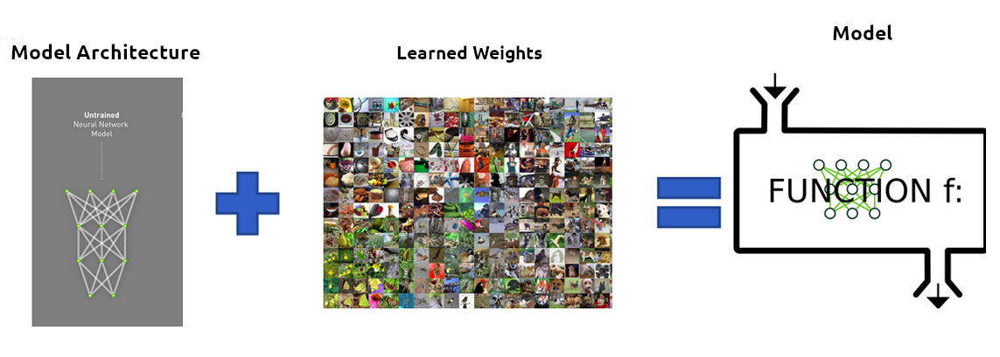
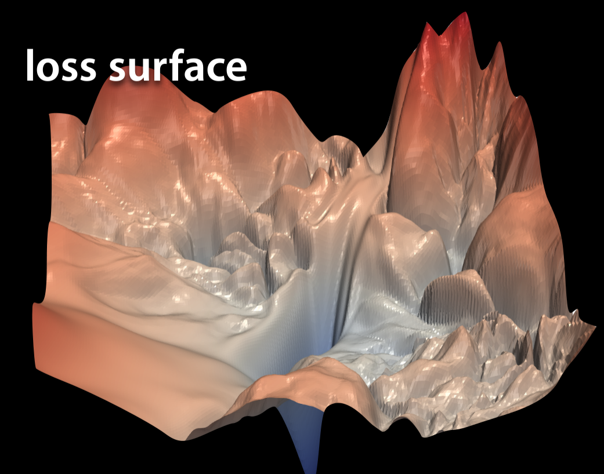
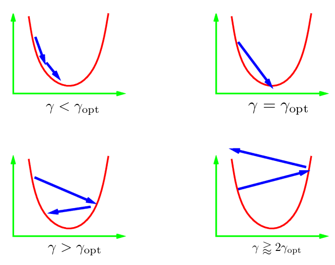
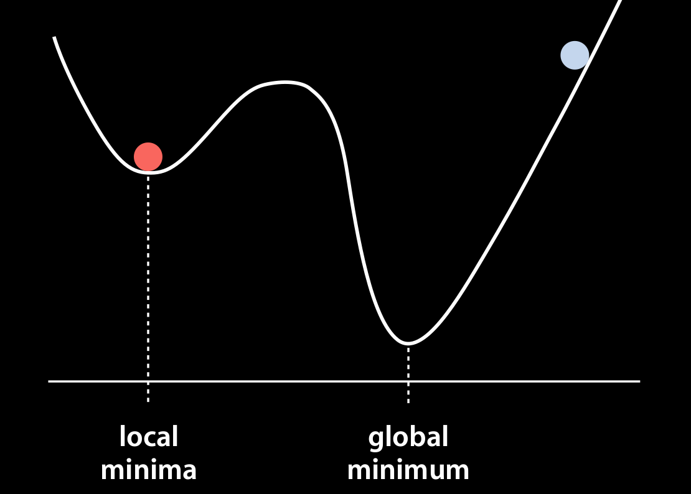
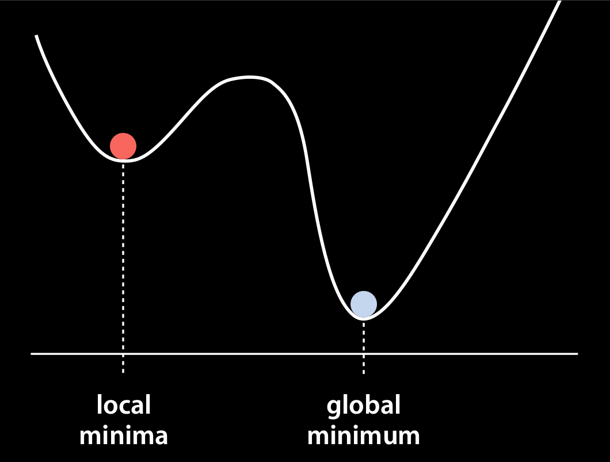

class: middle, center, title-slide

# Методи чисельної оптимізації

Лекція 5: Градієнтний спуск та імпульс
  
Кочура Юрій Петрович 
[iuriy.kochura@gmail.com](mailto:iuriy.kochura@gmail.com)  
<a href="https://t.me/y_kochura">@y_kochura</a>  

---

class:  black-slide, 
background-image: url(./figures/lec1/blog-header-cost-optimization-examples.jpg)
background-size: cover

# Сьогодні

.larger-x[ 
Як ефективно оптимізувати параметри?  

🎙️ Пакетний градiєнтний спуск  
🎙️ Стохастичний градiєнтний спуск  
🎙️ Мiнi-пакетний градiєнтний спуск  
🎙️ Iмпульс    

]

---

class: blue-slide, middle, center
count: false

.larger-xx[Оптимізація параметрів]

---

class: middle

# Модель

Хоча те, що знаходиться всередині глибокої нейронної мережі, може бути складним, у своїй основі це просто функції. Вони приймають деякі вхідні дані та генерують деякі вихідні дані (прогнози).

.center.width-30[]

.footnote[Credits: NVIDIA]

---

class: middle

# Компоненти моделі

.center.width-100[]

.footnote[Credits: NVIDIA]

???
Навчена мережа складається з двох компонентів:
- Опис архітектури ненавченої мережі.
- Ваги, які були "вивчені" під час навчання мережі.

---

class: middle

# Загальний процес навчання для нейронних мереж

1. Визначте завдання + зберіть дані
2. Ініціалізуйте параметри
3. Оберіть алгоритм оптимізації
4. Повторіть ці кроки:
.smaller-xx[
    4.1. Пряме пошерення вхідних даних

    4.2 Обчислення цільової функцію витрат]
.smaller-xx[
    4.3 Зворотне поширення: обчисліть градієнти цільової функції втрат відносно параметрів

    4.4 Оновіть кожен параметр за допомогою градієнтів відповідно до алгоритму оптимізації]

---

class:  black-slide, 
background-image: url(./figures/lec5/optimization.png)
background-size: cover

---

class: blue-slide, middle, center
count: false

.larger-xx[Оптимізаційні алгоритми]

---

class: middle

# Гіперпараметри & Параметри

- Результатом оптимізації є набір параметрів
- Гіперпараметри vs. Параметри

.grid[
.kol-1-2[
**Гіперпараметри**
.smaller-xx[
- Коефіцієнт поділу датасету навчання/валідація/тестування
- Швидкість навчання в алгоритмах оптимізації
- Кількість прихованих шарів у НМ
- Кількість блоків активації в кожному шарі
- Розмір пакету

.center[$\vdots$]
]]
.kol-1-2[
**Параметри**
.smaller-xx[
- Ваги та зсуви НМ
- Центроїди кластерів у кластеризації
]]]

.footnote[Credits:: [Kizito Nyuytiymbiy](https://towardsdatascience.com/parameters-and-hyperparameters-aa609601a9ac)]

???
Hyperparameters are parameters whose values control the learning process and determine the values of model parameters that a learning algorithm ends up learning. The prefix ‘hyper_’ suggests that they are ‘top-level’ parameters that control the learning process and the model parameters that result from it.

Parameters on the other hand are internal to the model. That is, they are learned or estimated purely from the data during training as the algorithm used tries to learn the mapping between the input features and the labels or targets.

---

class: middle

# Задача оптимізації

## Мінімізація емпіричного ризику (втрат)

$$W\_\*^\{\mathbf{d}} = \arg \min\_W \mathcal{J}(W) = \arg \min\_W \frac{1}{n} \sum\_{i=1}^n \mathcal{L}\left(y^{(i)}, f(\mathbf{x}^{(i)}, W)\right)$$

---

class: black-slide

.width-100[]

.footnote[Slide source: [Deep Learning in Computer Vision ](https://www.cs.ryerson.ca/~kosta/CP8309-F2018/index.html)]

---

class: middle

## Практичні рекомендації

Навчання масивної глибокої нейронної мережі є тривалим та складним процесом.

Першим кроком до розуміння, налагодження та оптимізації нейронних мереж є використання інструментів візуалізації:

- побудова графіків втрат та інших метрик продуктивності,
- візуалізація обчислювальних графіків,
- показ додаткових даних під час навчання мережі.

---

class: blue-slide, middle, center
count: false

.larger-xx[Пакетний градiєнтний спуск 

GD]

---

class: middle

# Пакетний градiєнтний спуск

Щоб мінімізувати $\mathcal{J}(W)$, 
**пакетний градієнтний спуск** (GD) використовує наступне правило:
$$\begin{aligned}
g\_t &= \frac{1}{n} \sum\_{i=1}^n \nabla\_W \mathcal{L}\left(y^{(i)}, f(\mathbf{x}^{(i)}, W)\right) = \nabla\_W \mathcal{J}(W)\\\\
W\_{t+1} &= W\_t - \alpha g\_t,
\end{aligned}$$
дек $\alpha$ &mdash; крок навчання.
.center.width-60[]

---

class: middle

# GD

.larger-x[Найгірший метод оптимізації в світі]

.alert[Примітка: ймовірно, Вам ніколи не слід використовувати градієнтний спуск безпосередньо, вважайте це будівельним блоком для інших методів.]

.footnote[Credits: Aaron Defazio, Facebook AI Research]

---

class: middle

# Крок навчання

.center.width-70[]

Тут $\gamma = \alpha$ &mdash; крок навчання.

.footnote[Credits: Aaron Defazio, Facebook AI Research]

???
The learning rate $\gamma = \alpha$ can be set by the algorithm designer. If we use a learning rate that is too small, it will cause $W$ to update very slowly, requiring more iterations to get a better solution.

Typically we don't have a good estimate of the learning rate. Standard practice is to try a bunch of values on a log scale and use the one that gave the best final result.

Learning rates that are too large cause divergence where the function value (loss) explodes.

The optimal learning rate can change during optimization! Often decreasing it over time is necessary.

---

class: black-slide

.width-100[]

.footnote[Slide source: [Deep Learning in Computer Vision ](https://www.cs.ryerson.ca/~kosta/CP8309-F2018/index.html)]

???
The empirical risk is an average loss on the training dataset while the risk is the expected loss on the entire population of data.

There are many challenges in deep learning optimization. Some of the most vexing ones are local minima, saddle points, and vanishing gradients.

---

class: black-slide

.width-100[]

.footnote[Slide source: [Deep Learning in Computer Vision ](https://www.cs.ryerson.ca/~kosta/CP8309-F2018/index.html)]

???
For any objective function $\mathcal{J}(W)$, if the value of $\mathcal{J}(W)$ at $W$ is smaller than the values of $W$ at any other points in the vicinity of $W$, then $\mathcal{J}(W)$ could be a local minimum. If the value of $\mathcal{J}(W)$ at $W$ is the minimum of the objective function over the entire domain, then $\mathcal{J}(W)$ is the global minimum.

---

class: black-slide, middle

.center[
<video loop controls preload="auto" height="600" width="600">
  <source src="./figures/lec5/follow-slope.mp4" type="video/mp4">
</video>
]

.footnote[Slide source: [Gradient descent, how neural networks learn](https://www.3blue1brown.com/lessons/gradient-descent)]

---

class: black-slide, middle

.center[
<video loop controls preload="auto" height="600" width="600">
  <source src="./figures/lec5/balls-rolling-down.mp4" type="video/mp4">
</video>
]

.footnote[Slide source: [Gradient descent, how neural networks learn](https://www.3blue1brown.com/lessons/gradient-descent)]

---

class: middle

.center[
<video loop controls preload="auto" height="600" width="600">
  <source src="./figures/lec5/opt-gd.mp4" type="video/mp4">
</video>
]

---

class: blue-slide, middle, center
count: false

.larger-xx[Cтохастичний градiєнтний спуск 

SGD]

---

class: middle

# SGD

Щоб зменшити обчислювальну складність, **стохастичний градієнтний спуск** (SGD) полягає в оновленні параметрів після кожного прикладу
$$\begin{aligned}
\ell^{(i)} &= \mathcal{L}\left(y^{(i)}, f(\mathbf{x}^{(i)}, W)\right) \\\\
g^{(i)}\_t &= \nabla\_W \ell^{(i)} \\\\
W\_{t+1} &= W\_t - \alpha g^{(i)}\_t
\end{aligned}$$

???
In deep learning, the objective function is usually the average of the loss functions for each example in the training dataset. Given a training dataset of $n$ examples, we assume that $\ell^{(i)}$ is the loss function with respect to the training example of index $i$, where $W$ is the parameter vector.

---

class: middle

# Переваги SGD

- Стохастичні градієнти обчислювати значно легше (пропорційно розміру набору даних), тому Ви часто можете зробити тисячі кроків SGD за вартість одного кроку GD.

- У середньому стохастичний градієнт є хорошою оцінкою градієнта.

- Шум може перешкоджати оптимізаційному сходженню до поганих локальних мінімумів.
.footnote[Credits: Aaron Defazio, Facebook AI Research]

---

class: blue-slide, middle, center
count: false

.larger-xx[Міні-пакети]

---

class: middle

# Міні-пакети

Обчислення втрат для міні-пакетів та оновлення параметрів
$$
\begin{aligned}
g^{(k)}\_t &= \frac{1}{B} \sum\_{i=1}^B \nabla\_W \mathcal{L}\left(y\_k^{(i)}, f(\mathbf{x}\_k^{(i)}, W)\right) \\\\
W\_{t+1} &= W\_t - \alpha g^{(k)}\_t,
\end{aligned}
$$
де $k$ &mdash; індекс міні-пакета.

- Збільшення розміру пакету $B$ зменшує дисперсію оцінок градієнта та забезпечує прискорення пакетної обробки.
- Взаємозв'язок між $B$ і $\alpha$ все ще незрозумілий.

---

class: blue-slide, middle, center
count: false

.larger-xx[Імпульс]

---

class: middle

# Імпульс

SGD + Імпульс = Стохастичний метод *важкої кулі*

$$
\begin{aligned}
p\_{t + 1} &= \beta\_t p\_{t} + \nabla \ell^{(i)} (W\_t)\\\\
W\_{t+1} &= W\_t - \alpha\_t p\_{t + 1}
\end{aligned}
$$

Правило оновлення:

$$
\begin{aligned}
W\_{t+1} &= W\_t - \alpha\_t \nabla \ell^{(i)} (W\_t) + \beta\_t \left(W\_{t} - W\_{t-1}\right)
\end{aligned}
$$

**Ключова ідея:** Наступний крок стає комбінацією напрямку попереднього кроку та нового негативного градієнта.

???
Momentum replaces gradients with a leaky average over past gradients. This accelerates convergence significantly. Momentum usually speeds up the learning with a very minor implementation change. 

---

<iframe class="iframemomentum" src="https://distill.pub/2017/momentum/" scrolling="no" frameborder="no"  style="position:absolute; top:-165px; left: -25px; width:950px; height: 600px"></iframe>

.footnote[Credits:  Distill, [Why Momentum Really Works?](https://distill.pub/2017/momentum/)]

???
**Intuition.** The optimization process resembles a **heavy ball** rolling down a hill. The ball has **momentum**, so it doesn’t change direction immediately when it encounters changes to the landscape!

---

class: middle, black-slide

.center[
<video loop controls preload="auto" height="500" width="600">
  <source src="./figures/lec5/sgd-momentum.mp4" type="video/mp4">
</video>
]

.footnote[Image credits: Kosta Derpanis, [Deep Learning in Computer Vision](https://www.cs.ryerson.ca/~kosta/CP8309-F2018/index.html), 2018]

---

class: middle

# Переваги

SGD з імпульсом має **три** хороші властивості:
- він може пройти через локальні бар'єри
- прискорюється, якщо градієнт не сильно змінюється
- гасить коливання у вузьких долинах

---

class: middle

## Практичні аспекти імпульсу

По суті, це **«безкоштовний обід»**, майже в усіх ситуаціях **SGD + імпульс** краще, ніж SGD, і дуже рідко гірше!

## Рекомендовані параметри:

$\beta = 0.9$ or $0.99$ майже завжди працють добре. Іноді можна отримати невеликі переваги, налаштувавши його.

Параметр розміру кроку ($\alpha$) зазвичай потрібно зменшувати, коли параметр імпульсу збільшується, щоб підтримувати збіжність.

.footnote[Credits: Aaron Defazio, Facebook AI Research]

---

class: end-slide, center
count: false

.larger-xxxx[🏁]

